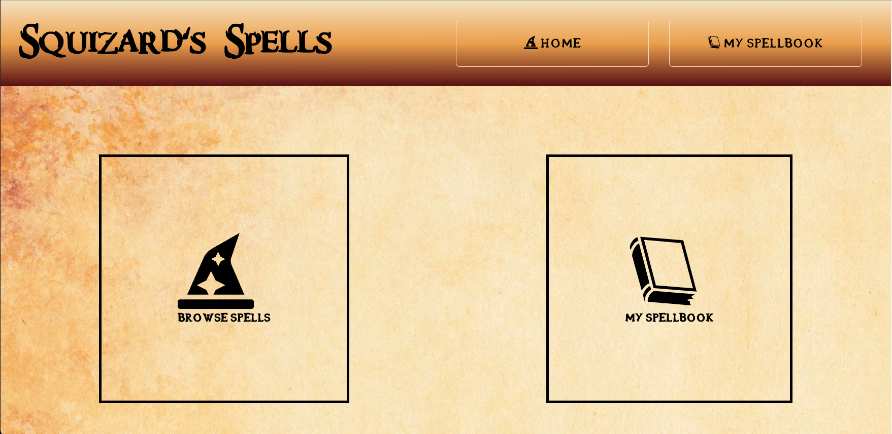
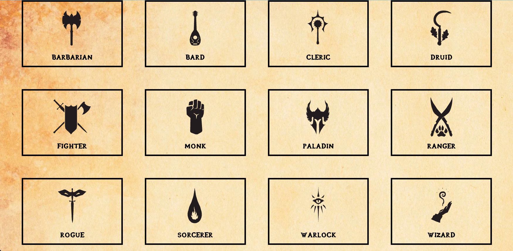
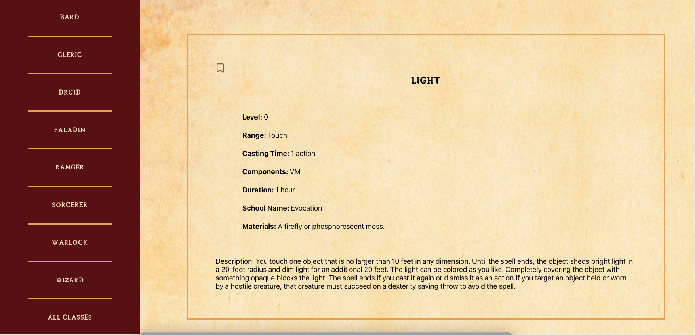
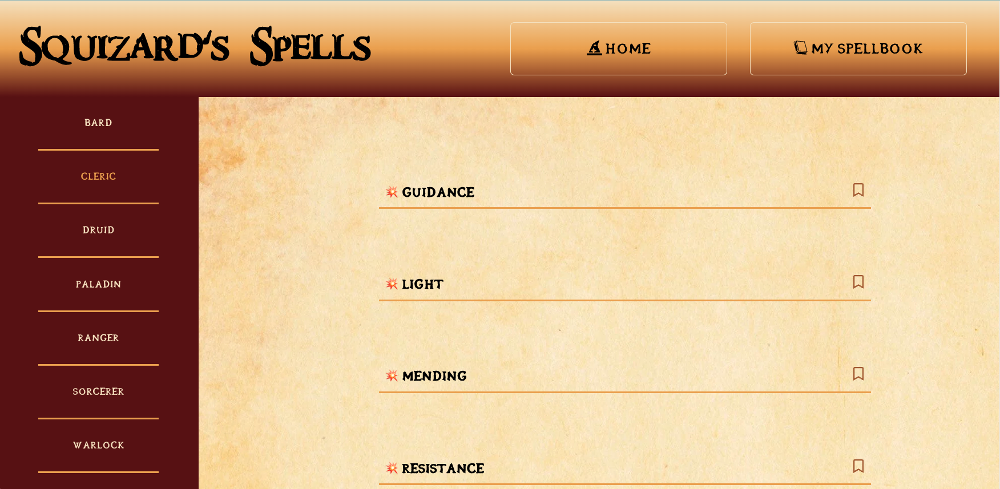

# Squizard's Spells

### Mod3 Group Stretch Tech Project

## Table of Contents
- [Abstract](#Abstract)
- [Technologies](#Technologies)
- [Illustrations](#Illustrations)
- [Install](#Install)
- [Wins](#Wins)
- [Challenges](#Challenges)
- [Additions](#Additions)
- [Contributors](#Contributors)

## Abstract
Squizard's Spells is an app that allows its users to filter through Dungeons and Dragons 5th Edition spells and save those spells in a personal spellbook. Spells saved will persist on page load as well. When a user reaches the site, they will be able to look at their personal spellbook or browse spells. Then they can choose the character class that they are playing to narrow it down to spells that that class can use. Players can then click on spells to get the full details or bookmark them to save them to their spellbook.

## Technologies
-  HTML
-  CSS
-  JavaScript
-  React
-  Context Api
-  Hooks

## Illustrations

## Install

-  Clone this [repo](https://github.com/elisebeall/dnd-spells) to your machine
-  cd into the directory `dnd-spells`
-  Run `npm install`
-  Run `npm start`

## Wins
- Researching Context Api and implementing it
- Using Hooks to help manage state

## Challenges
- context api
- Custom hooks
- Building a React app of this size

## Additions
### Future Iterations
- Add ability to create a character
- Impliment ability to sort spells by level

## Contributors
- [August Reid](https://github.com/augustreid)
- [Brian Peterson](https://github.com/bpeterson2579)
- [Elise Beall](https://github.com/elisebeall)
